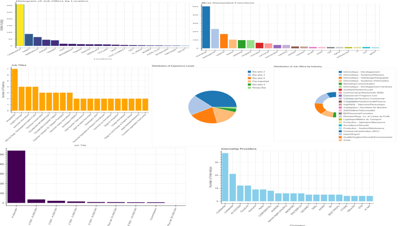
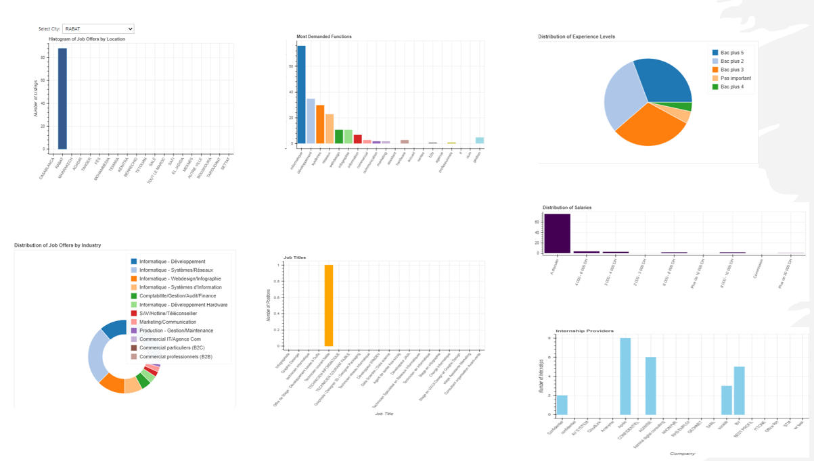
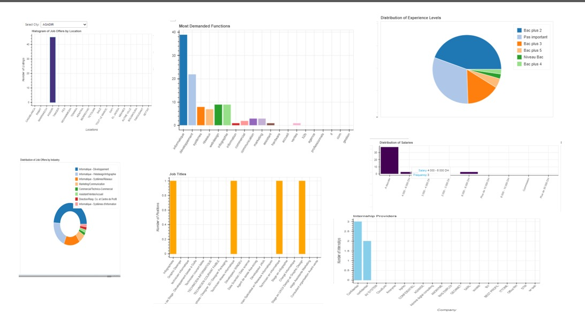

## bokeh_app

Ce projet est de créer une application interactive de visualisation de données sur les offres
d’emploi au Maroc.

### choix de data
Les offres d’emploi constituent un sujet crucial et d’intérêt majeur pour de nombreux acteurs au Maroc,
notamment les chercheurs d’emploi, les entreprises et les décideurs politiques. Comprendre les tendances
du marché de l’emploi, identifier les secteurs les plus dynamiques et saisir les besoins en compétences des
employeurs est essentiel pour favoriser l’employabilité et le développement économique du pays. L’analyse
et la visualisation de ces données sur les offres d’emploi peuvent révéler des informations précieuses,
telles que des tendances, des motifs et des insights intéressants sur le marché du travail. Ces informations
peuvent s’avérer extrêmement utiles pour guider les décisions des chercheurs d’emploi, des entreprises et
des décideurs politiques, contribuant ainsi à améliorer l’adéquation entre l’offre et la demande de maind’œuvre. Ainsi, le choix de ce dataset marocain sur les offres d’emploi présente un fort potentiel d’impact et d’amélioration de la compréhension du marché de l’emploi. 

### Description de la data

La dataset obtenue est formée des colonnes suivantes data et contient 654 offres :
• title: Cette colonne contient le titre de l’offre.
• location: La ville où se situe l’entreprise pour les offres.
• time: La date de publication de l’offre.
• Domaine: Le dommaine de cette offre
• Fonction: La fonction spécifique du poste à pourvoir. Il s’agit généralement d’une description plus
détaillée du poste.
• Contrat: Le type de contrat proposé pour le poste à pourvoir.
• Entreprise: Le nom de l’entreprise qui propose le poste à pourvoir.
• Salaire: Le salaire proposé pour le poste à pourvoir. Le salaire est généralement indiqué en dirhams
marocains (DH)
• Niveau d’étude: le niveau d’études minimum requis pour le poste à pourvoir
###  Visualisations
Nous avons réaliser 7 différentes visualisations interactives pour analyser les offres d’emploi au Maroc.

### Interectivite
Pour concrétiser l’interactivité de l’application Bokeh, on prend deux exemples des villes ’Rabat’ et ’Agadir’
avec les 7 différentes visaulisations

### google colab 
https://colab.research.google.com/drive/1OShcQlE3YMLd1GvCCExKhTxviM8IWfJT#scrollTo=CZH_KvLQYKzY
